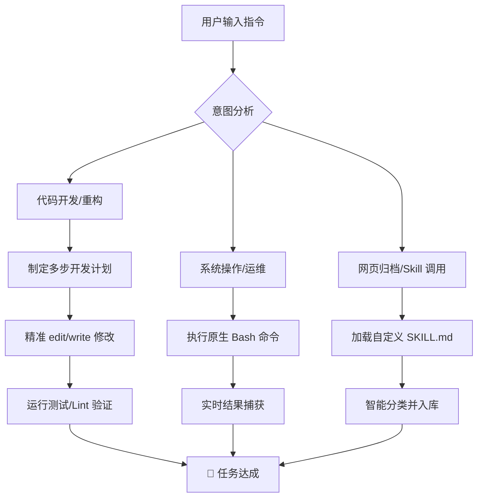

# Opencode 入门到精通：你的全能 Agentic AI 编程搭档

> **关键词**：Agentic AI, CLI, 自动化归档, 智能代码编辑, 自定义 Skills

Opencode 不仅仅是一个命令行工具, 它是专为极客设计的 **Agentic AI 编程搭档**。它打破了传统 AI 助手只能“说话”的局限，能够直接深入你的代码库，操作文件系统，执行 Bash 指令，甚至能帮你从互联网上抓取并分类归档任何有价值的技术文档。

---

## 1. 核心架构：像开发者一样思考

Opencode 的强大源于其 **“理解 -> 规划 -> 执行 -> 验证”** 的闭环思维模式。

---

## 2. 杀手级功能：为什么选它？

### 🚀 2.1 自动化网页归档 (Web-Archive)
通过内置的 `web-archive` 技能，Opencode 可以实现真正的“一键搬运”。它会自动清理网页噪声，保留所有图片路径，并智能识别内容领域（AI/科技/健康 等）进行分类存放。

*图：Opencode 正在执行深度抓取，确保内容 100% 忠实于原网页*

### 🛠️ 2.2 智能代码编辑
不同于传统的全文重写，Opencode 使用 `edit` 工具进行 **精准行级替换**。这意味着你的代码缩进、注释和编码风格都会被完美保留。

---

## 3. 极客实验：Canvas 绘图与渲染

在 Markdown 中玩转 HTML5 Canvas？在 Opencode 这里是可行的。以下是一个实时渲染的系统状态示例（依赖于渲染器的 HTML 兼容性）：

  <canvas id="opencodeCanvas" width="400" height="100" style="border:1px solid #d3d3d3; border-radius: 8px; background: #fafafa;">
    您的环境不支持 HTML5 Canvas。
  </canvas>
  

> [!TIP]
> **小贴士**：在 Obsidian 或具备现代 HTML 解析能力的查看器中，上述 Canvas 脚本将直接渲染出动态的“运行中”状态。

---

## 4. 技能树：自定义 Skills 系统

你可以通过在 `.claude/skills/` 目录下编写 `SKILL.md` 来无限扩展 Opencode 的能力上限。

| 技能名称 | 核心黑科技 | 调用体感 |
| :--- | :--- | :--- |
| **`web-archive`** | 深度抓取+媒体保留+智能分类 | "归档这个 Substack 链接" |
| **`md-to-pdf`** | 保持目录结构的批量 PDF 转换 | "把整个科技目录转成 PDF" |
| **`ai-writing-style`** | 基于现有笔记的文风精准模仿 | "用我的语气写篇 Gemini 评测" |

---

## 5. 命令速查表 (Cheat Sheet)

| 场景 | 核心工具 | 极客建议 |
| :--- | :--- | :--- |
| **文件读取** | `read` | 自动处理绝对路径，无需手动 CD |
| **内容搜索** | `grep` | 支持正则，在大规模代码库中极速定位 |
| **大规模任务** | `task` | 启动子代理并行处理，节省上下文 Token |
| **系统控制** | `bash` | 运行 `npm`, `git`, `docker` 等任何 CLI 指令 |

---

> [!IMPORTANT]
> **写在最后**：Opencode 不是要替代你，而是要给你配一个“全能替身”。它负责处理琐碎的文档归档、样板代码和环境部署，让你把精力留给真正的 **架构设计** 和 **业务逻辑**。

**开始你的 Agentic 编程之旅吧！**
